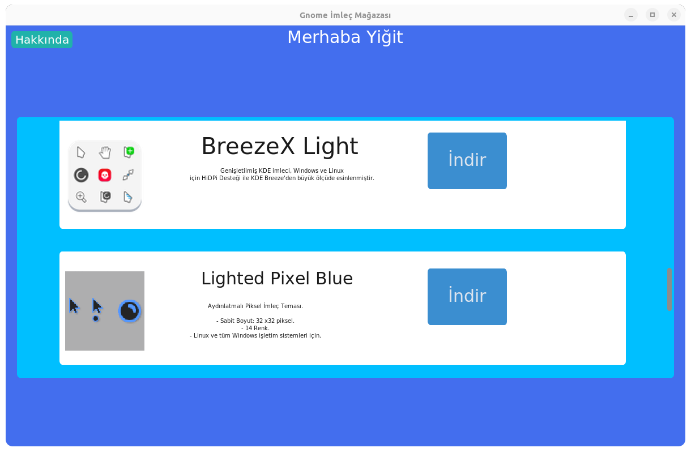
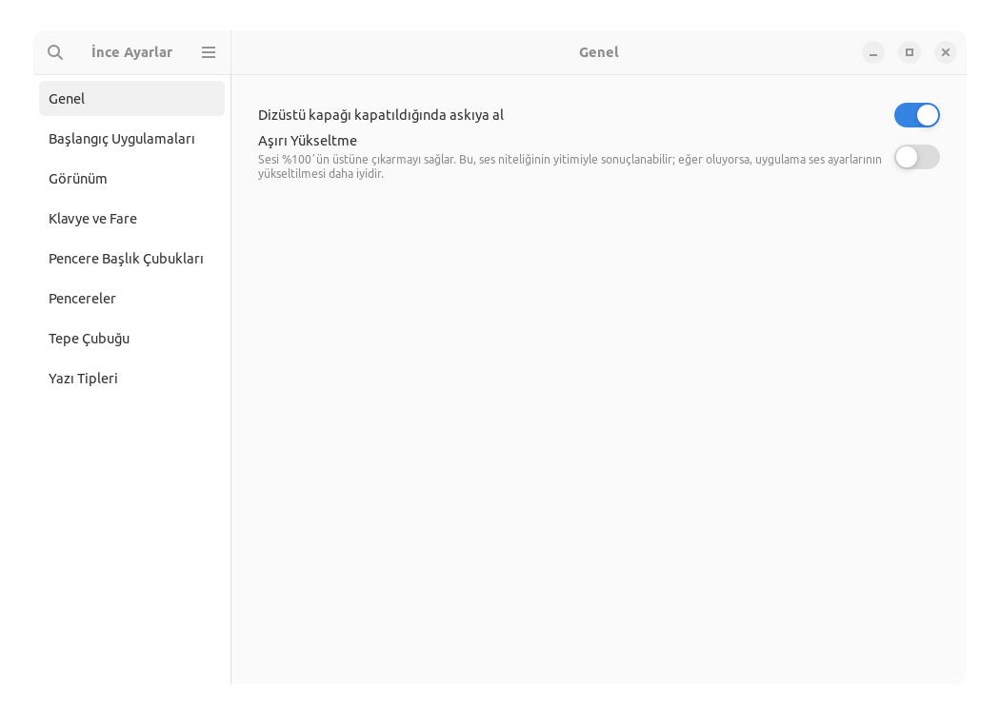
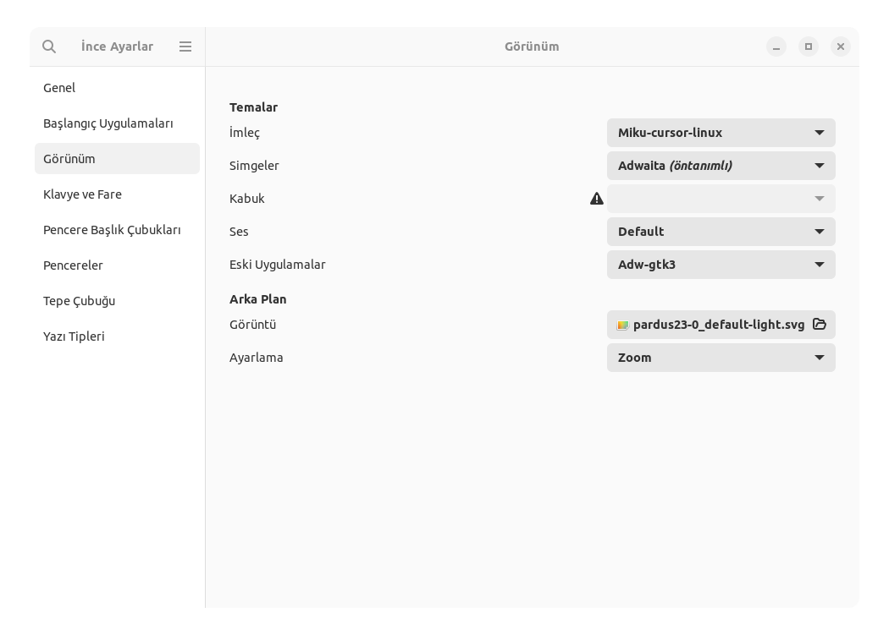
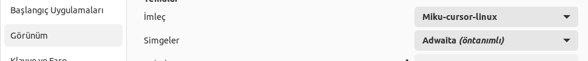

<div align="center">

# Gnome İmlec Mağazası

Gnome için geliştirdiğim İmleç Mağazasıdır. İstediğiniz imleç temasını indirip kaldırabilirsiniz, hemde tek tıkla. Bu proje, başarısız olan <a href="https://github.com/YigitC7/PardusTemaStore"> Pardus Tema Mağazası</a> projesinin kaynak kodlarının geri dönüştürülmüş halidir.
  <a>
    
  </a>
  
  
  

</div>

## Nasıl Kullanılır?
Henüz beta aşamasında olduğu için bazı optimizasyon hataları olabilir. Bir temayı "İndir" butonuna bastığınız anda, tema hızlı bir şekilde sisteminize yüklenir! Ancak bazı optimizasyon hataları nedeniyle, indirme ve kaldırma işlemleri sırasında program yanıt vermeyebilir. Bu yüzden, aynı anda birden fazla işlem yapmaya çalışmayın.

## İndirilen Tema Nasıl Aktif Edilir?
Bir temayı indirdiniz ama nasıl aktif hale getireceğinizi bilmiyor musunuz? o zaman şu adımları takip edin:
### 1 Pardus uygulama arama bölümüne "ince ayarlar" uygulamasını arayın ve o uygulamayı açın

## 2 Uygulamayı açtıktan sonra "Görünüm" sekmesine girin

## 3 Sekmeyi açtıktan sonra İmleçleri ve Simgeleri buradan değiştirebilirsiniz


## İndirmek

### Dosyalar
Derlenmiş program dosyası: <b><a href="https://github.com/YigitC7/Gnome_imlec_magazasi/releases/download/1.0/Gnome_imlec_magazasi_1.0.tar.xz">indir</a> 64 Bit</b>

### Manuel Derleme
Programı derlemek için aşağıdaki komudu terminale yapıştırın
```bash	
sudo apt update -y && sudo apt upgrade -y
sudo apt install git python3-venv -y
git clone https://github.com/YigitC7/Gnome_imlec_magazasi.git
cd Gnome_imlec_magazasi
python3 -m venv lib
source lib/bin/activate
pip install --upgrade pip setuptools wheel
pip install pyinstaller customtkinter Pillow requests
pip install --no-cache-dir --force-reinstall Pillow
pyinstaller --noconsole --onefile --windowed --hidden-import=PIL._tkinter_finder --hidden-import=PIL._imagingtk main.py
cp -f dist/main GnomeImlecMagazasi
```

## Kaynak
Bütün tema paketleri <a href="https://www.gnome-look.org/browse/">Gnome look</a> sitesinden alınmıştır ve indirme işlemini benim Google Drive depomdan yapar, işte bütün <a href="https://drive.google.com/drive/folders/1pMVBmQWIJZRVufvMEMjYwO-ck17EqKq1?usp=drive_link">Temalar</a>

<br>

> İmleç Mağazasında bulunan imleç sayısı 12


