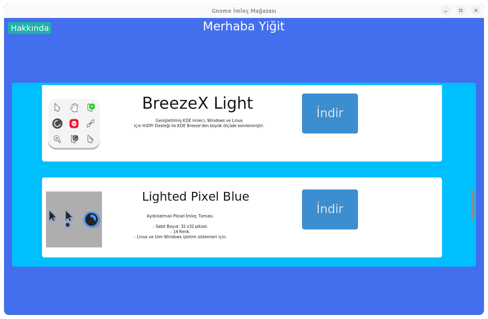
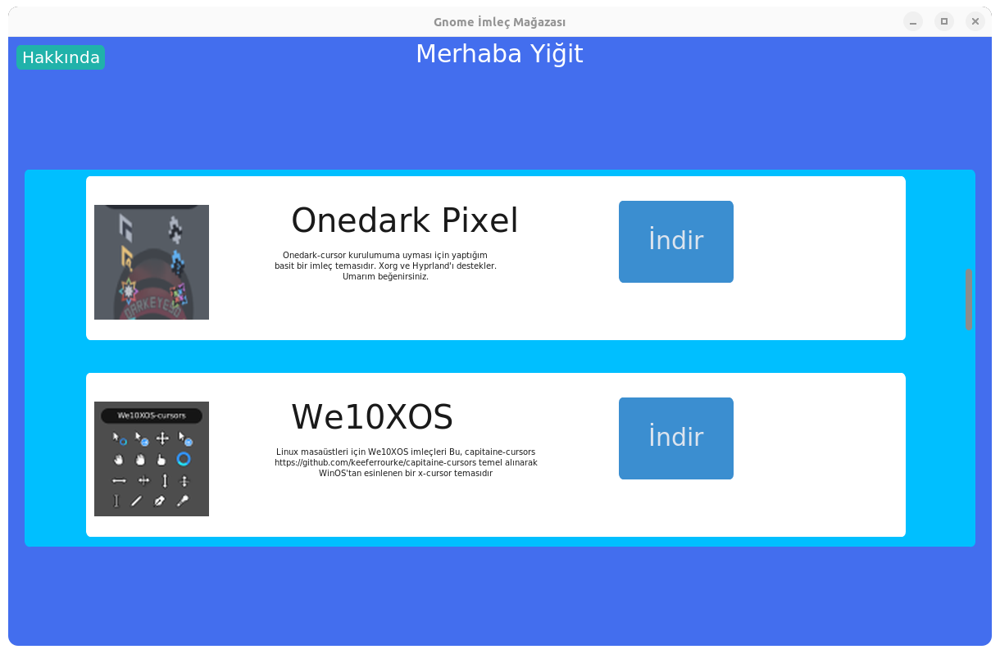
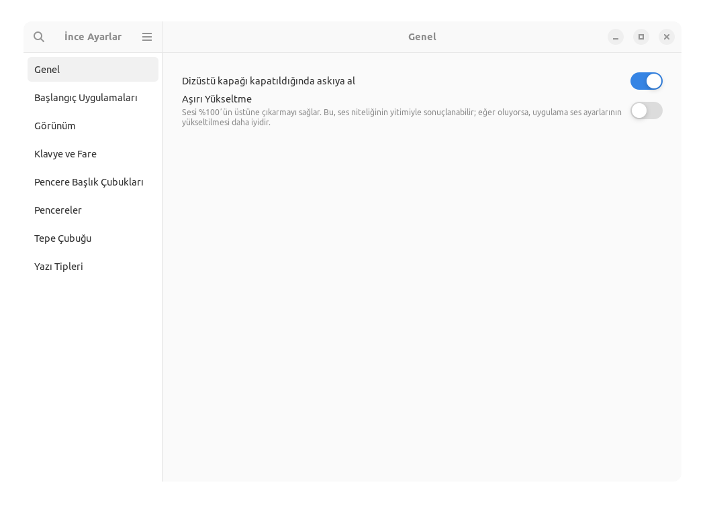
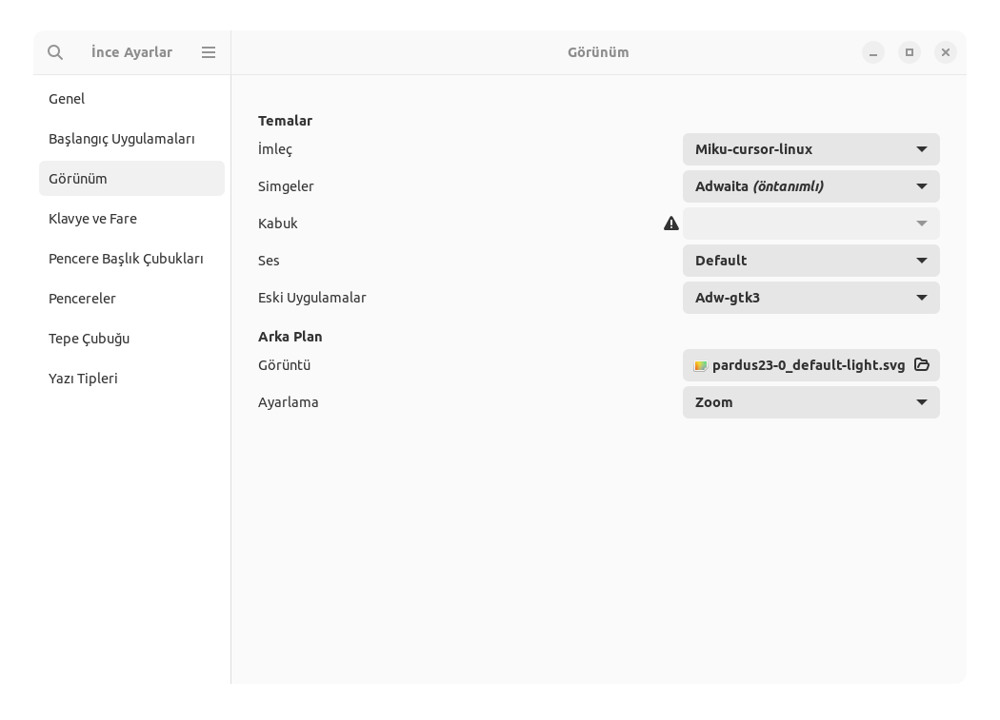
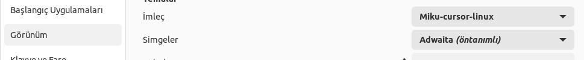

# Gnome Cursor Store

It is the Cursor Store that I developed for Gnome. You can download and remove any cursor theme you want, with just one click. 
  
  
  
  

## How to Use?
Once you click the "Download" button on a theme, it will be quickly installed on your system!

## How to Activate a Downloaded Theme?
Have you downloaded a theme but don't know how to activate it? Then follow these steps:
### Search for the "GNOME Tweaks" application in the app search section and open it

## 2 After opening the application, go to the "View" tab

## 3 After opening the tab, you can change Cursors and Icons from here

